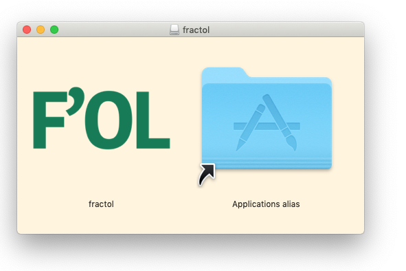

# Fract'ol

Résumé: Créer graphiquement de jolies fractales.

## Mac App

[](https://drive.google.com/open?id=1yv9u1YI1tcDdnKvpMugl-nQSvAdbweeD)

## Getting Started

These instructions will get you a copy of the project up and running on your local machine.

### Prerequisites

```bash
$> git clone https://github.com/nicolasvienot/fractol.git Fractol
```

### Compiling

```bash
$> make
```

### Running

```bash
$> ./fractol [fractal name]
```

Fractal names (with uppercase letter) :

Mandelbrot, Duobrot, Tricorn, BurningShip, Palmtree, Multibrot, Julia, Andy, Microcells, Brain, Flower, Multijulia

### Controls

Action | Key
---------------------- | ---------
Building 1 | <kbd>h</kbd>
Building 2 | <kbd>&nbsp;scroll up&nbsp;</kbd>
